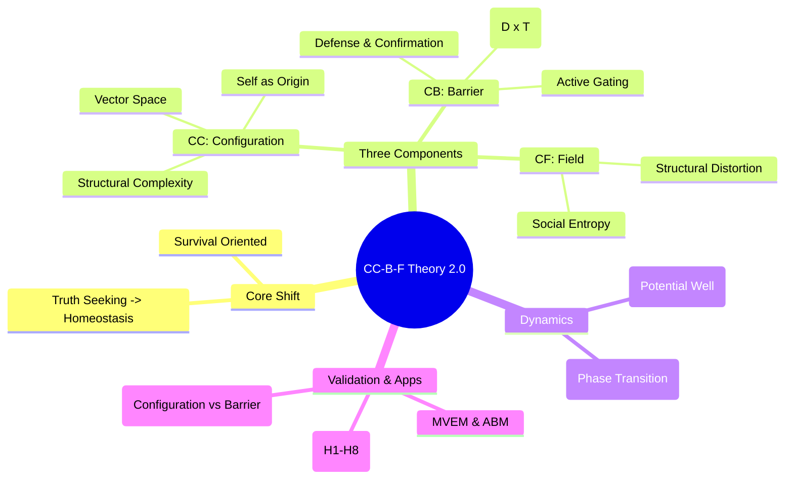

# Cognitive Configuration-Barrier-Field (CC-B-F) Theory
### A Formal, Computable & Falsifiable Model of Subjective Reality & Affective Homeostasis Maintenance

 
 


**Author:** Zhenpeng Lin (Independent Researcher)  
**ORCID:** [0009-0003-1770-2543](https://orcid.org/0009-0003-1770-2543)  
**Date:** December 21, 2025 (Version 2.0)

---

## 🧠 Core Proposition
The primary objective of a cognitive system is **not** "Truth Seeking" (error minimization), but **Cognitive-Affective Homeostasis Maintenance**.

CC-B-F reframes **Cognitive Barriers (CB)** as an **active, bidirectional, functional information regulation system** driven by the interaction of cognitive conflict (D) and emotional threat (T): **D × T**.

## 📝 Abstract
This paper proposes the "Cognitive Configuration-Barrier-Field" theory (CC-B-F) as a computable and falsifiable formal framework integrating cognitive psychology, information theory, neuroscience, and artificial intelligence.

Core innovations:
- Shift cognitive goal from "error minimization" to **cognitive-affective homeostasis maintenance**.
- Redefine cognitive barriers from passive noise/belief defense to active regulation protecting cognitive consistency, system resilience, and a controllable **affective baseline**.

The model formalizes three components:
1. **Cognitive Configuration (CC)**: Dynamic high-dimensional vector space (self-schema as origin).
2. **Cognitive Barrier (CB)**: Active gating function with D × T interaction.
3. **Cognitive Field (CF)**: Social information ecosystem measurable by entropy.

## 🗺️ Visual Overview



## 🔑 Key Components & Innovations

* **Thermodynamic Basis**: Entropy management in an affective field.
* **Falsifiability**: Computable metrics (e.g., Cognitive Barrier Strength - CBS).
* **Hybrid Model vs. Predictive Coding**: Bottom-up error minimization; top-down homeostasis maintenance.
* **Applications**: AI alignment, communication failure quantification, psychological resilience.

## 📄 Official Paper

Official archived version with DOI (for citation):

* 🔗 **Zenodo DOI**: [10.5281/zenodo.18009961](https://doi.org/10.5281/zenodo.18009961)
* 📥 **Download Full PDF (v2.0)**: [Direct link](https://raw.githubusercontent.com/Zhenpeng-Lin/CC-B-F-Theory/main/papers/%E8%AE%A4%E7%9F%A5%E6%9E%84%E5%9E%8B-%E5%A3%81%E5%9E%92-%E5%9C%BA%E5%9F%9F%E7%90%86%E8%AE%BA%EF%BC%88CC-B-F%EF%BC%892.0.pdf)
* 🌐 **Faster Online View (CDN)**: [jsDelivr link](https://cdn.jsdelivr.net/gh/Zhenpeng-Lin/CC-B-F-Theory@main/papers/%E8%AE%A4%E7%9F%A5%E6%9E%84%E5%9E%8B-%E5%A3%81%E5%9E%92-%E5%9C%BA%E5%9F%9F%E7%90%86%E8%AE%BA%EF%BC%88CC-B-F%EF%BC%892.0.pdf)

**Citation** (BibTeX available on Zenodo):

> Lin, Z. (2025). 认知构型-壁垒-场域理论（CC-B-F）2.0. Zenodo. https://doi.org/10.5281/zenodo.18009961

## 📂 Repository Structure

* `/papers`: PDF versions
* `/images`: Diagrams and mind maps
* `/docs`: Supplementary materials (coming soon)

```

```
